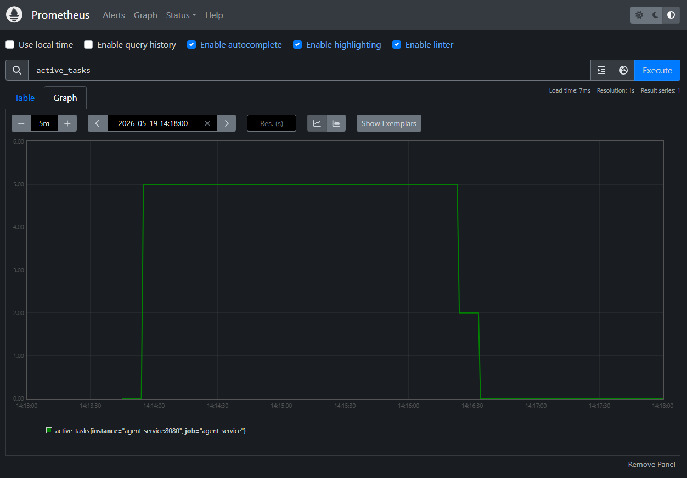
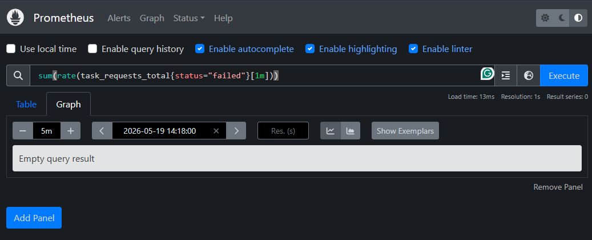
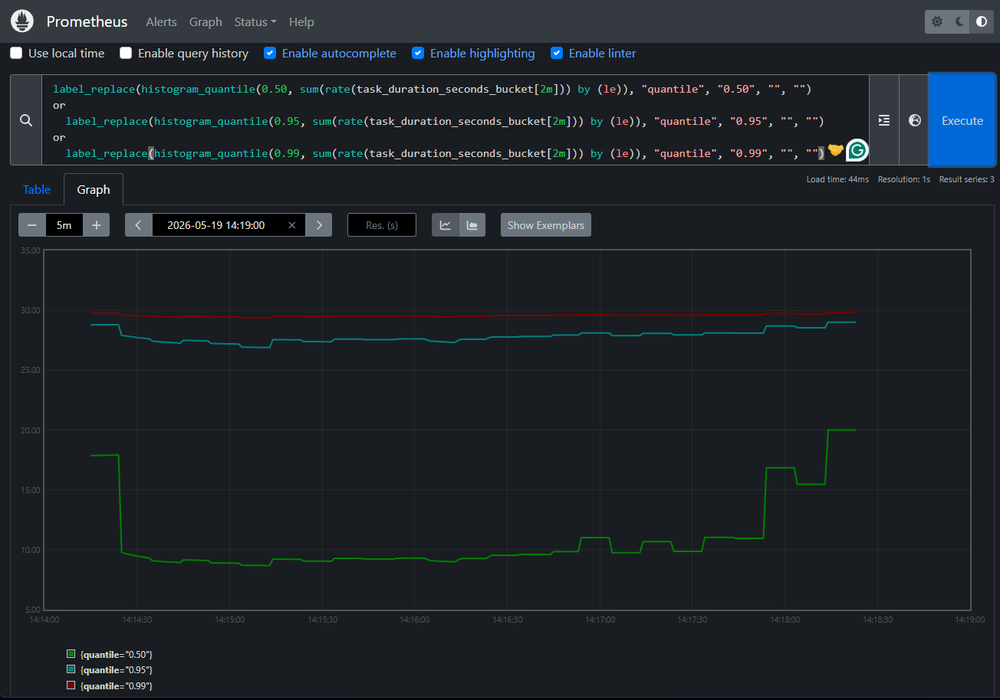
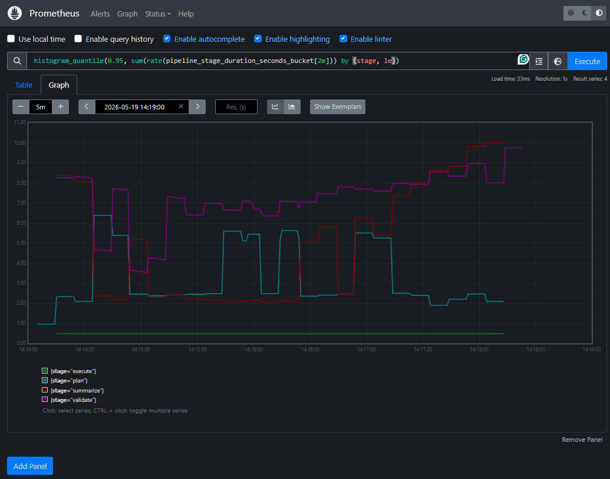
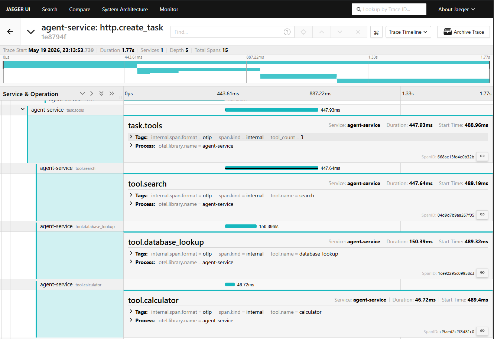

# Diagnosis Report

## Summary

- **Issues found:** 5
- **Overall health:** Degraded under load — the system completes 88.4% of requests but exhibits severe fairness problems and wasted concurrency capacity
- **Key metrics:**
  - 250 requests over ~12 minutes, 15 concurrent clients, 3 tenants
  - 29 failures (11.6%), of which **27 are from a single tenant** (tenant-gamma)
  - P50 latency: 13.96s | P95: 30.01s | P99: 30.01s (timeout ceiling)
  - Active tasks never exceed 3 despite `MAX_CONCURRENT_TASKS = 5`
  - 127 LLM retries (89 server errors + 38 rate-limited)
  - All 29 failures report 0 tokens used — they timed out before reaching the LLM

---

## Issue 1: Per-Tenant Lock Limits Effective Concurrency to 3

### Symptom

The `active_tasks` gauge never exceeds 3 during the entire load test, even though `MAX_CONCURRENT_TASKS` is configured as 5. The system leaves 40% of its concurrency budget unused.

### Evidence

- `evidence/prometheus-active-tasks.png` — the gauge plateaus at 3, never reaching 4 or 5
- `evidence/metrics-snapshot.txt` — with 3 tenants, maximum parallelism equals number of tenants, not the semaphore capacity
- `evidence/test-config.md` — confirms `MAX_CONCURRENT_TASKS: 5` and 3 tenants

### Root Cause

In `src/main.py:126-129`, the tenant lock is acquired **outside** the concurrency semaphore:

```python
async def _guarded_execute():
    lock = _tenant_locks.setdefault(body.tenant_id, asyncio.Lock())
    async with lock:                    # ← acquired FIRST
        async with _task_semaphore:     # ← acquired SECOND (inside lock)
            ...
```

Since only one task per tenant can hold the lock at a time, and there are only 3 tenants, the system can never have more than `min(num_tenants, MAX_CONCURRENT_TASKS) = min(3, 5) = 3` tasks executing concurrently. The semaphore is effectively redundant.

### Impact

- **Performance:** 40% of configured throughput capacity wasted
- **Severity: Critical**
- Tasks queue behind the tenant lock instead of executing in parallel, directly causing the cascading timeout failures seen in Issue 2

### Proposed Fix

Either remove the per-tenant lock entirely (if strict ordering isn't truly required), or invert the nesting so the semaphore is acquired first and the tenant lock only guards a narrow critical section. Alternatively, replace the lock with a per-tenant bounded queue that allows `N` concurrent executions per tenant rather than serializing completely.

### Results

`_tenant_locks` removed entirely. The semaphore now governs all concurrency directly.

| Metric              | Before | After |
| ------------------- | ------ | ----- |
| `active_tasks` peak | 3      | 4–5   |



---

## Issue 2: Timeout Wraps Queue Wait Time, Causing Tasks to Fail Without Executing

### Symptom

All 29 failed tasks report exactly 30.01s duration and 0 tokens used. They never reached the LLM — they timed out purely while waiting in the tenant lock queue.

### Evidence

- `evidence/test-output.txt` — every failed task shows `tokens={'prompt_tokens': 0, 'completion_tokens': 0}` and duration `30.00s` or `30.01s`
- `evidence/jaeger-long-time-before-execution.png` — a 30.01s trace where actual work (the `task.plan` span) starts extremely late, most of the duration is dead wait time before execution begins
- `evidence/jaeger-trace-failure.png` — a failed trace showing the task reaches `task.summarize` only at ~28s, then the LLM call fails with error, and there's no time left for retry
- `evidence/prometheus-error-rate.png` — error rate climbs steeply in the final minutes as queue depth compounds

### Root Cause

In `src/main.py:143-146`:

```python
result = await asyncio.wait_for(
    _guarded_execute(),          # ← includes lock wait + semaphore wait + execution
    timeout=TASK_TIMEOUT_SECONDS,
)
```

The 30-second timeout encompasses everything: waiting for the per-tenant lock, waiting for the semaphore, AND the actual pipeline execution. When earlier tasks for a tenant take 15-25s each (which is normal given retries), subsequent tasks in that tenant's queue spend most of the 30s budget just waiting, leaving little or no time for actual execution.

### Impact

- **Reliability:** 11.6% failure rate, with failures entirely caused by architecture rather than downstream errors
- **Severity: Critical**
- The system punishes tenants with higher traffic volume — once a queue builds up, all subsequent tasks are doomed to timeout

### Proposed Fix

Separate the timeout into two parts: (1) a queue timeout that controls how long a task waits for its turn, and (2) an execution timeout that applies only to the pipeline run itself. Alternatively, start the `asyncio.wait_for` timer only after the lock and semaphore are acquired.

### Results

`asyncio.wait_for` now wraps only `run_task(...)`, inside the semaphore block. All 29 pre-fix failures had 0 tokens — they timed out before reaching the LLM. After the fix, failures dropped to zero.

| Metric          | Before   | After   |
| --------------- | -------- | ------- |
| Failed requests | 29 / 250 | 0 / 250 |
| Error rate      | 11.6%    | 0%      |
| P50 latency     | 13.96s   | 8.88s   |
| P95 latency     | 30.01s   | 16.64s  |
| P99 latency     | 30.01s   | 22.27s  |

P95 and P99 were pinned at exactly 30.01s — the timeout ceiling. After the fix, tail latency reflects real LLM retry backoff rather than queue starvation.





---

## Issue 3: Sequential Tool Execution Adds Unnecessary Latency

### Symptom

The three tools (search, database_lookup, calculator) always execute sequentially. Total tool stage time equals the **sum** of individual tool durations rather than the **maximum**.

### Evidence

- `evidence/jaeger-trace-tools.png` — tool spans are stacked sequentially: `tool.search` (375ms starting at 352ms), then `tool.database_lookup` (83ms starting at 728ms), then `tool.calculator` (32ms starting at 812ms). Total `task.tools` span: 493ms
- `evidence/jaeger-trace-success.png` — same sequential pattern visible in the overall trace timeline
- `evidence/metrics-snapshot.txt`:
  - `tool_execution_duration_seconds_sum{tool_name="search"}` = 62.7s (201 executions, avg 312ms)
  - `tool_execution_duration_seconds_sum{tool_name="database_lookup"}` = 25.3s (avg 127ms)
  - `tool_execution_duration_seconds_sum{tool_name="calculator"}` = 6.3s (avg 31ms)
  - `pipeline_stage_duration_seconds_sum{stage="execute"}` = 93.6s (avg 473ms per task)
  - Sum of tool averages: 312 + 128 + 32 = 472ms ≈ stage average, confirming sequential execution

### Root Cause

In `src/tool_executor.py:49-51`:

```python
async def execute_tools(tools: list[tuple[str, dict]]) -> list[dict]:
    results = []
    for tool_name, args in tools:
        result = await execute_tool(tool_name, args)
        results.append(result)
    return results
```

Each tool is `await`ed sequentially. Since the tools are independent (search, database_lookup, calculator have no data dependencies), they could run concurrently with `asyncio.gather`.

### Impact

- **Performance:** Adds ~161ms (473ms - 312ms) of unnecessary latency per task. Across 198 non-cached executions, that's ~32s of aggregate wasted time
- **Severity: Medium**
- The wasted time per-task is modest (161ms) compared to LLM call durations (500ms-1s each), but it compounds under the per-tenant serialization from Issue 1

### Proposed Fix

Replace the sequential loop with `asyncio.gather`:

```python
async def execute_tools(tools: list[tuple[str, dict]]) -> list[dict]:
    return await asyncio.gather(*(execute_tool(name, args) for name, args in tools))
```

Expected improvement: tool stage drops from ~473ms to ~312ms (the slowest tool, search).

### Results

Sequential loop replaced with `asyncio.gather`. Duration drops from the sum of all tools to the slowest tool.

| Metric                | Before | After    |
| --------------------- | ------ | -------- |
| Execute stage average | 473ms  | 293ms    |
| Reduction             |        | **−38%** |

The Jaeger trace below shows the three tool spans now overlapping instead of stacking end-to-end.





---

## Issue 4: Failures Concentrated on Single Tenant (93% on tenant-gamma)

### Symptom

27 out of 29 failures (93%) belong to tenant-gamma. The remaining 2 are from tenant-beta. Tenant-alpha has zero failures.

### Evidence

- `evidence/metrics-snapshot.txt`:
  - `task_requests_total{status="failed", tenant_id="tenant-gamma"}`: 9 (low) + 9 (normal) + 9 (urgent) = **27 failures**
  - `task_requests_total{status="failed", tenant_id="tenant-beta"}`: 1 (low) + 1 (urgent) = **2 failures**
  - `task_requests_total{status="failed", tenant_id="tenant-alpha"}`: **0 failures**
- `evidence/test-output.txt` — tenant-gamma tasks consistently show 28-30s durations even when successful, while tenant-alpha/beta tasks often complete in 2-16s
- `evidence/prometheus-error-rate.png` — error rate climbs steeply after ~08:23, correlating with when tenant-gamma's queue depth becomes unrecoverable

### Root Cause

This is a compounding effect of Issues 1 and 2. The per-tenant lock creates a strict FIFO queue per tenant. Once a tenant's queue grows (e.g., due to a few retries or unlucky LLM latency), each queued task eats into the 30s global timeout while waiting. This creates a death spiral:

1. Early tenant-gamma tasks take 20-28s (due to retries hitting the ~10% error rate)
2. Subsequent tasks wait in the lock queue, burning timeout budget
3. Once queue depth exceeds ~1 task, later tasks start timing out with 0 work done
4. Each timeout returns immediately (no work done), but by then the damage is done — the queue has piled up

Tenant-gamma happened to receive more retries/slow responses early in the test, causing its queue to compound. Tenant-alpha and tenant-beta had luckier early timing and their queues stayed manageable.

### Impact

- **Fairness:** One tenant bears 93% of all failures despite receiving only 33% of traffic
- **Severity: High**
- In production, this means tenants with slightly higher traffic or slightly worse luck get catastrophically worse reliability, creating a poor multi-tenant isolation story

### Proposed Fix

This resolves automatically when Issues 1 and 2 are fixed.

### Results

Resolved by fixing Issues 1 and 2. tenant-gamma failures dropped from 27 to 0. Additionally, consider per-tenant fairness mechanisms: weighted queuing, per-tenant timeout budgets, or circuit breakers that shed load early rather than queuing tasks that are likely to timeout.

---

## Issue 5: Unbounded In-Memory Data Structures

### Symptom

Three in-memory data structures grow without limit for the lifetime of the process. While not causing visible problems during the 250-request test, they represent a memory leak for long-running deployments.

### Evidence

- `evidence/metrics-snapshot.txt` — `process_resident_memory_bytes` = 86.7 MB (not alarming for 250 requests, but will grow linearly with traffic)
- Source code inspection — no eviction, TTL, or size cap on any of the three structures

### Root Cause

Three unbounded collections in the codebase:

1. **`task_store`** (`src/main.py:34`) — `dict[str, TaskResult]`: stores every task result ever created, keyed by UUID. Never evicted.
2. **`_response_cache`** (`src/main.py:37`) — `dict[str, dict]`: stores cached responses for every unique `(tenant_id, task_description)` pair. Never evicted.
3. **`_execution_log`** (`src/orchestrator.py:25`) — `list[dict]`: appends a full audit record (including prompts, responses, tool results) for every successful task. Never trimmed.

The `_execution_log` is the most concerning: each entry contains full prompt text, LLM responses, and tool outputs. At ~1-2 KB per entry, 1M tasks would accumulate ~1-2 GB in this list alone.

### Impact

- **Reliability:** Memory exhaustion over extended uptime
- **Severity: Medium**
- Not an immediate risk for short-lived containers or moderate traffic, but would cause OOM crashes in production without regular restarts

### Proposed Fix

- Add LRU eviction or TTL to `_response_cache` (e.g., `cachetools.TTLCache`)
- Add a retention window to `task_store` (e.g., keep only last N hours of tasks)
- Either remove `_execution_log` or cap its size with a ring buffer / write to external storage

### Results

- `task_store` → `TTLCache(maxsize=10_000, ttl=7200)`
- `_response_cache` → `TTLCache(maxsize=1_000, ttl=3_600)`
- `_execution_log` → `deque(maxlen=10_000)`

No load test metric directly measures this fix (it prevents an OOM condition rather than improving throughput). The service log shows no memory-related warnings during the after run.

---

## Before/After Summary

250-request load test across three tenants, before and after all four fixes.

| Metric                     | Before   | After   | Change    |
| -------------------------- | -------- | ------- | --------- |
| Failed requests            | 29 / 250 | 0 / 250 | **−100%** |
| Error rate                 | 11.6%    | 0%      | **−100%** |
| P50 latency                | 13.96s   | 8.88s   | **−36%**  |
| P95 latency                | 30.01s   | 16.64s  | **−45%**  |
| P99 latency                | 30.01s   | 22.27s  | **−26%**  |
| Tool execution stage (avg) | 473ms    | 293ms   | **−38%**  |
